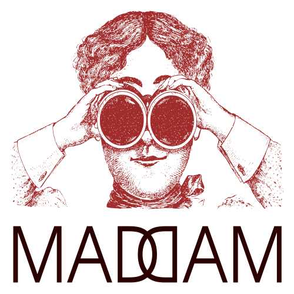

[English](index.html) | [polski](index_pl.html)

# Witamy!

## MADAM - Metody analizy danych: algorytmy i modelowanie

Organizatorzy: dr hab. inż. [Marek Gagolewski](http://www.gagolewski.com), dr inż. [Grzegorz Siudem](http://www.if.pw.edu.pl/~siudem/)

Czas: wybrane piątki, godz. 14:15-16:00, s. 318

Miejsce: [Wydział Matematyki i Nauk Informacyjnych](https://ww2.mini.pw.edu.pl/) Politechniki Warszawskiej,
[ul. Koszykowa 75](https://goo.gl/maps/83p1mQsCmrz), Warszawa

Tematyka:

* agregacja i fuzja danych
* uczenie maszynowe
* sieci złożone
* algorytmy analizy danych
* modelowanie zjawisk w naukach ekonomicznych i społecznych

# Plan spotkań

t.b.d.
